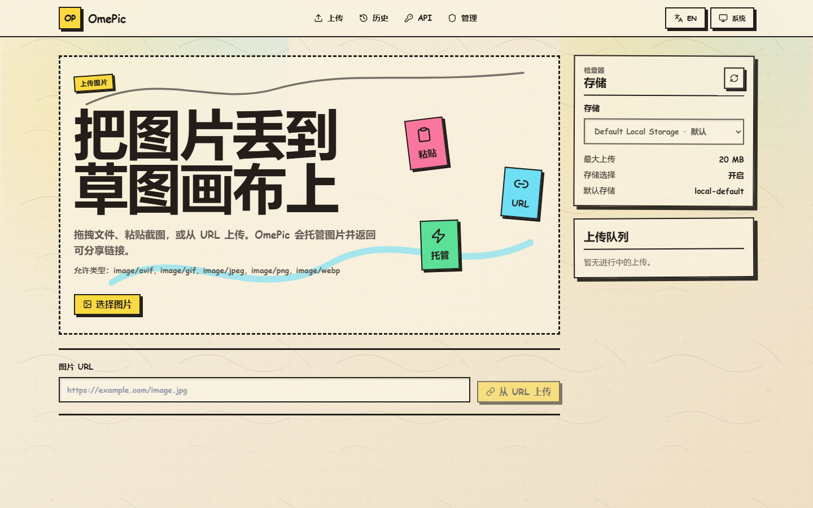
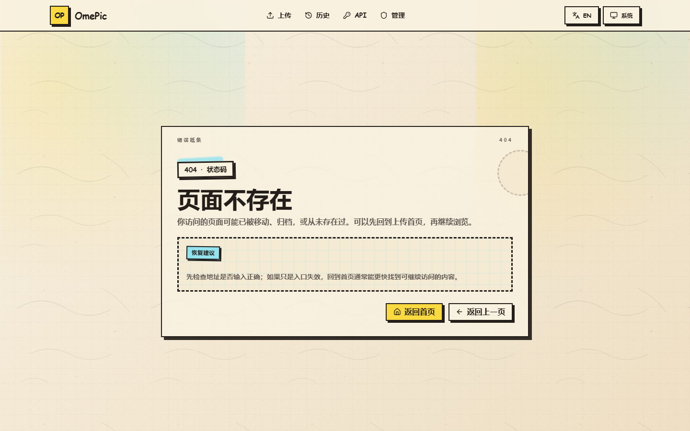

# 🖼️ OmePic

**自托管图片托管服务 — 自动 AVIF 转换 · MD5 去重 · 多后端存储**

> [US](docs/language/README_EN.md)


---

## 📸 截图

<p align="center">
  
</p>

<p align="center">
  
  
</p>

## ✨ 核心功能

- **自动 AVIF 转换** — 上传图片自动转换为 AVIF 格式，支持后台可配置质量/速度/并发/超时和像素上限
- **动画 GIF 保留** — 上传的动图 GIF 自动转为动画 AVIF，保留所有帧（最多 300 帧）
- **MD5 去重** — 相同内容的上传复用已有物理文件，按存储实例作用域隔离
- **多后端存储** — 支持本地文件系统、S3 兼容服务和 WebDAV，运行时动态管理，无需重启
- **管理后台** — JWT 保护的管理面板，支持图片管理、存储配置和系统设置
- **凭据加密存储** — S3/WebDAV 等敏感凭据使用 AES-256-GCM 加密后存入 SQLite，纵深防御
- **JWT 会话撤销** — 修改密码时自动撤销所有已签发的管理员 JWT，降低泄漏窗口
- **IP 封禁与滥用监控** — 封禁恶意 IP，按 IP 和 Token 追踪上传量
- **公告系统** — 发布带时间窗口和优先级的公告
- **运行时配置** — 站点名称、上传限制、MIME 白名单、AVIF 参数、Cloudflare purge、维护模式、速率限制，全部可在后台 UI 中编辑
- **Token 认证** — 无需注册账户，客户端使用 Web Crypto API 生成的 Token 标识上传者并授权删除操作
- **拖拽 / 粘贴 / URL 上传** — 灵活的上传方式，上传历史通过 IndexedDB 本地持久化
- **单端口部署** — 生产构建将前端静态资源复制到 `backend/web/`，单一端口同时提供 API 和前端

## 🔒 安全特性

| 特性 | 说明 |
|------|------|
| **强制密钥配置** | `JWT_SECRET`、`UID_ENCRYPTION_KEY`、`SECRET_ENCRYPTION_KEY` 缺失或不足 32 字符时服务拒绝启动 |
| **CORS 分离** | 公开 API 支持 CORS（允许 Origin 由运行时配置热更新），管理 API 严格同源（无 CORS 头） |
| **CSP 兼容 SvelteKit 静态输出** | 前端 HTML 页面允许内联脚本/样式以兼容 SvelteKit 启动脚本和动态样式，同时保留 `object-src 'none'`、`frame-ancestors 'none'`、`base-uri 'self'` 等约束 |
| **JWT 短 TTL** | 管理员 JWT 有效期 4 小时（原 24 小时），降低泄漏风险 |
| **JWT 撤销** | 修改密码后旧 JWT 立即失效（Redis `admin_revoked_before` 时间戳比对） |
| **Body 限制** | 上传路由在 multipart 解析前设置 `MaxBytesReader`，超大请求在 HTTP 层即被拒绝 |
| **安全头** | 全局 `X-Content-Type-Options: nosniff`、`Referrer-Policy: strict-origin-when-cross-origin`；前端额外 `X-Frame-Options: DENY`；API 额外 `Cache-Control: no-store` |
| **限流 fail-closed** | 上传和登录接口 Redis 故障时拒绝请求，不做本机兜底；普通 GET fail-open |
| **凭据加密** | S3 密钥、WebDAV 密码等敏感字段 AES-256-GCM 信封加密写入 SQLite |
| **X-Token 安全** | 前端使用 `crypto.randomUUID` / `crypto.getRandomValues` 生成 Token，无 `Math.random` 降级 |

## 🛠️ 技术栈

| 层次 | 技术 | 用途 |
|------|------|------|
| 后端 | **Go** + [Gin](https://github.com/gin-gonic/gin) | HTTP API、中间件、路由 |
| 数据库 | **SQLite** (modernc.org/sqlite) | 元数据和配置持久化（纯 Go，无 CGO） |
| 缓存 | **Redis** (go-redis) | UID/MD5 缓存、去重查询、JWT 撤销、限流计数 |
| 图片转换 | [discord/lilliput](https://github.com/discord/lilliput) + [gen2brain/avif](https://github.com/gen2brain/avif) | lilliput 负责 Linux/macOS 动图 AVIF 编码（CGO）；gen2brain/avif 为 Windows 回退（纯 Go，仅静态） |
| 前端 | **Svelte 5** + **SvelteKit 2** + **Tailwind CSS** | SPA，静态适配器导出 |
| ID 生成 | Snowflake + XOR + Base62 | 不透明、URL 安全的公开 UID（XOR 混淆密钥，非密码学安全边界） |
| 认证 | [golang-jwt/v5](https://github.com/golang-jwt/jwt) | 管理员 JWT 会话 + Redis 撤销 |
| 凭据加密 | AES-256-GCM (crypto/aes) | 存储配置敏感字段信封加密 |
| S3 | [minio-go/v7](https://github.com/minio/minio-go) | S3 兼容对象存储 |
| WebDAV | [gowebdav](https://github.com/studio-b12/gowebdav) | WebDAV 存储客户端 |

## 🏗️ 架构

```
┌─────────────────────────────────────────────────┐
│                  浏览器                          │
│   SvelteKit SPA（静态导出）                      │
│   上传界面 · 管理后台 · 系统设置                 │
└────────────────────┬────────────────────────────┘
                     │
                     ▼
┌─────────────────────────────────────────────────┐
│            Gin HTTP 路由（Go）                   │
│   中间件（安全头 / CORS分离 / 认证 /            │
│   速率限制 / Body限制 / JWT撤销 / 日志）        │
│   处理器 · 前端静态资源托管                      │
└───────┬──────────┬──────────┬───────────────────┘
        ▼          ▼          ▼
  ┌──────────┐ ┌────────┐ ┌────────────┐
  │  图片    │ │ 管理   │ │  存储      │
  │  服务    │ │ 服务   │ │  管理器    │
  └────┬─────┘ └────────┘ └─────┬──────┘
       ▼                        ▼
  ┌──────────┐          ┌──────────────────┐
  │  SQLite  │          │ 本地 / S3 /      │
  │ （仓储） │          │ WebDAV 提供者    │
  │ + 凭据   │          │ （凭据加密存储） │
  │  加密层  │          └──────────────────┘
  └────┬─────┘
       ▼
  ┌──────────┐
  │  Redis   │
  │ （缓存 + │
  │  JWT撤销 │
  │  限流）  │
  └──────────┘
```

**请求流向**：浏览器 → Gin 路由（安全头 → CORS分离 → Body限制 → 鉴权/限流 → JWT撤销检查） → 业务服务层 → SQLite 持久化（凭据加密） + Redis 缓存 + 存储后端写入

## 🚀 快速开始

### 环境要求

- **Go** 1.25+
- **Node.js** 20+（含 npm）
- **Redis** 7+

### 克隆项目

```bash
git clone https://github.com/OuOumm/OmePic.git
cd OmePic
```

### 环境变量配置

复制示例文件并填写所有密钥：

```bash
cp .env.production.example .env
```

**必填密钥**（缺失或不足 32 字符时服务拒绝启动）：

```env
JWT_SECRET=            # JWT 签名密钥，≥32 字符
UID_ENCRYPTION_KEY=    # UID XOR 混淆密钥（非密码学安全边界），≥32 字符
SECRET_ENCRYPTION_KEY= # AES-256-GCM 凭据加密密钥，恰好 32 字节
```

完整变量列表见[环境变量](#-环境变量)。

### 方式一：直接运行

```bash
cd backend
go run ./cmd/server
```

### 方式二：Docker Compose

```bash
# 编辑 .env 填入所有必填密钥后
docker compose up -d
```

服务在 `http://localhost:8080` 启动，Redis 健康检查后自动连接。

### 前端开发启动

```bash
cd frontend
npm install
npm run dev
```

开发服务器在独立端口运行，带热重载。API 请求代理到后端。

### 生产单端口构建

```bash
cd frontend
npm run build:backend
cd ../backend
go run ./cmd/server
```

`build:backend` 将 SvelteKit 应用编译为静态资源并复制到 `backend/web/`。Go 二进制在单一端口同时提供 API 和前端服务。

### 首次登录

1. 打开 `http://localhost:8080/admin`
2. 使用默认密码登录：**`admin123`**
3. 在 **设置 → 密码** 中立即修改密码

> ⚠️ 默认密码首次登录时自动哈希写入 SQLite。请在公开部署前修改；未修改默认密码前，存储配置和系统设置等高风险更新会被拒绝。

## 🔧 环境变量

| 变量 | 必填 | 默认值 | 说明 |
|------|------|--------|------|
| `HTTP_ADDR` | 否 | `:8080` | HTTP 服务监听地址 |
| `DATABASE_PATH` | 否 | `data/omepic.db` | SQLite 数据库文件路径 |
| `REDIS_URL` | 否 | `redis://localhost:6379/0` | Redis 连接地址 |
| `UID_PREFIX` | 否 | `omeo_` | UID 混淆前的明文前缀（尾部下划线自动规范化） |
| `UID_ENCRYPTION_KEY` | **是** | — | UID XOR 混淆密钥（≥32 字符；命名保留 "encryption" 部署兼容，实际为混淆而非加密） |
| `JWT_SECRET` | **是** | — | 管理员 JWT 签名密钥（≥32 字符；TTL 4 小时） |
| `SECRET_ENCRYPTION_KEY` | **是** | — | AES-256-GCM 凭据加密密钥（恰好 32 字节；用于加密 SQLite 中 S3/WebDAV 等敏感凭据） |
| `PUBLIC_BASE_URL` | 生产必填 | — | 公开访问 URL（生产环境缺填则启动失败） |
| `APP_ENV` | 否 | — | 设为 `production` 启用严格检查；空或 `development` 为宽松模式 |

> 其他所有设置（存储、上传限制、AVIF 参数、Cloudflare purge、维护模式、速率限制）均通过管理后台运行时配置，无需设置环境变量。

## 📡 API 概览

### 公开端点（CORS 支持，允许 Origin 由运行时配置热更新）

| 方法 | 路径 | 说明 |
|------|------|------|
| `GET` | `/health` | 健康检查（SQLite + Redis） |
| `GET` | `/v1/runtime-settings` | 获取公开的站点/上传配置 |
| `GET` | `/v1/announcements` | 获取已发布的公告 |
| `POST` | `/v1/image` | 上传图片（需要 `X-Token`；Body 限制 `maxUploadSize + 1 MiB`） |
| `GET` | `/i/:uid.avif` | 获取图片（返回 AVIF 字节；长缓存策略） |
| `DELETE` | `/i/:uid.avif` | 删除图片（需要与上传时相同的 `X-Token`） |

> 存储选项通过 `GET /v1/runtime-settings` 的 `storage.options` 返回。

### 管理端点（严格同源，无 CORS 头；需要 JWT Bearer 认证）

| 方法 | 路径 | 说明 |
|------|------|------|
| `POST` | `/admin/login` | 管理员认证，返回 JWT（TTL 4h） |
| `PUT` | `/admin/password` | 修改密码（同时撤销所有旧 JWT） |
| `GET` | `/admin/status` | 全局上传统计 |
| `GET` | `/admin/images` | 分页图片列表（支持搜索） |
| `DELETE` | `/admin/images` | 按 UID 批量删除图片 |
| `GET` | `/admin/system-settings` | 获取运行时 + 只读设置（含密钥配置状态） |
| `PUT` | `/admin/system-settings` | 更新运行时设置 |
| `GET` | `/admin/config` | 获取存储目录 |
| `POST` | `/admin/config/storage-instances` | 创建存储实例 |
| `PUT` | `/admin/config/storage-instances/:storageKey` | 更新存储实例 |
| `DELETE` | `/admin/config/storage-instances/:storageKey` | 删除存储实例 |
| `POST` | `/admin/config/default` | 设置默认存储 |
| `GET` | `/admin/storage/health` | 获取各存储实例最新健康状态 |
| `GET` | `/admin/storage/:key/health-history` | 获取存储健康历史 |
| `POST` | `/admin/storage/:key/health-check` | 立即检查单个存储实例 |
| `POST` | `/admin/storage/health-check-all` | 立即检查全部存储实例 |
| `GET/POST/DELETE` | `/admin/ip-bans` | 管理 IP 封禁 |
| `GET` | `/admin/abuse/overview` | 滥用统计概览 |
| `GET` | `/admin/abuse/ip` | 指定 IP 的滥用详情 |
| `GET/POST/PUT/DELETE` | `/admin/announcements` | 管理公告 |
| `POST` | `/admin/cloudflare/purge-image-cache` | 手动清理单个 Cloudflare 图片 URL 缓存 |

## 💾 存储后端

OmePic 支持三种存储后端，通过管理后台运行时配置，无需重启：

| 后端 | 键值 | 适用场景 |
|------|------|----------|
| **本地** | `local` | 文件存储在服务器本地文件系统（默认：`data/images/`） |
| **S3** | `s3` | AWS S3、MinIO 或任何 S3 兼容服务 |
| **WebDAV** | `webdav` | 任何 WebDAV 兼容服务器 |

- 每种后端可创建多个实例（如两个 S3 存储桶）
- 上传时可选让用户选择存储目标
- 每张图片记录其 `storage_key`，不允许对已使用的存储实例切换后端类型
- **S3/WebDAV 等敏感凭据**（Access Key、Secret Key、密码）在 SQLite 中以 AES-256-GCM 加密存储

## ⚙️ 运行时配置

所有运行时配置在管理后台（`/admin → 设置`）中管理，修改后立即生效，无需重启。

| 配置项 | 默认值 | 说明 |
|--------|--------|------|
| 站点名称 | `OmePic` | UI 和页面标题中显示 |
| 站点标语 | `上传、分享和管理图片` | 浏览器标题元数据 |
| 公开 URL | *（必填）* | 生产环境必须配置；覆盖公开访问地址 |
| 真实 IP 来源 | `remote-addr` | 反向代理后解析真实 IP 的方式（可选 `x-forwarded-for`、`x-real-ip`、`cf-connecting-ip`） |
| Cloudflare purge | `false` | 可选清理单个图片 URL 缓存 |
| 最大上传大小 | `20` MB | 单文件上传限制 |
| 允许的 MIME 类型 | `image/jpeg, png, gif, webp, avif` | 接受的上传格式 |
| AVIF 质量 | `60` | 编码器质量（0=最低，100=无损） |
| AVIF 速度 | `8` | 编码器速度（0=最慢/最佳压缩，10=最快） |
| 最大图片像素 | `40,000,000` | 解码后像素上限 |
| AVIF 最大并发 | `2` | 后端 AVIF 转换并发上限 |
| AVIF 转换超时 | `30` 秒 | 单张图片转换超时 |
| 允许选择存储 | `true` | 允许上传者选择存储目标 |
| 维护模式 | `false` | 开启后阻止上传并显示自定义消息 |
| 速率限制 | `120 次/分钟` | 通用 API 速率限制 |
| 上传速率限制 | `20 次/10分钟` | 上传接口专用速率限制 |

## 📂 项目结构

```
OmePic/
├── backend/
│   ├── cmd/server/              # 启动入口 + 密钥强制校验
│   ├── internal/
│   │   ├── auth/                # JWT 生成/验证 + Redis 撤销检查
│   │   ├── cache/               # Redis 客户端与预热
│   │   ├── config/              # 环境变量配置加载
│   │   ├── http/
│   │   │   ├── clientip/        # 客户端 IP 解析（运行时热更新）
│   │   │   ├── handler/         # HTTP 处理器
│   │   │   ├── middleware/      # 安全头、CORS分离、Body限制、认证、速率限制
│   │   │   └── router/          # Gin 路由注册
│   │   ├── iputil/              # IP 哈希与脱敏
│   │   ├── model/               # 数据结构
│   │   ├── ratelimit/           # 速率限制器（Redis fail-closed/open）
│   │   ├── repository/          # SQLite 数据访问层
│   │   ├── response/            # JSON 响应辅助函数
│   │   ├── secrets/             # AES-256-GCM 信封加密/解密
│   │   ├── service/             # 业务逻辑层（凭据加密写入/解密读取）
│   │   ├── storage/             # 本地 / S3 / WebDAV 提供者
│   │   └── uid/                 # UID 编码（Snowflake + XOR + Base62 混淆）
│   ├── web/                     # 生产前端资源（构建生成）
│   └── data/                    # 运行时数据（SQLite、图片）
├── frontend/
│   ├── src/
│   │   ├── lib/
│   │   │   ├── api.ts           # API 客户端
│   │   │   ├── client-token.ts  # X-Token 生成（Web Crypto API，无 Math.random）
│   │   │   ├── components/      # UI 组件
│   │   │   ├── indexeddb/       # 上传历史持久化
│   │   │   ├── stores/          # Svelte runes 状态管理
│   │   │   ├── types/           # TypeScript 类型定义
│   │   │   └── i18n.ts          # 国际化
│   │   └── routes/              # SvelteKit 页面
│   └── package.json
├── .github/workflows/ci.yml     # CI 流水线
├── Dockerfile                   # 多阶段构建
├── docker-compose.yml           # Docker Compose 配置
└── .env.production.example      # 生产环境变量示例
```

## 🧑‍💻 开发指南

### 后端

```bash
cd backend

# 启动服务（需先配置 .env 中的必填密钥）
go run ./cmd/server

# 运行所有测试
go test ./...

# Vet 检查
go vet ./...
```

### 前端

```bash
cd frontend

# 开发服务器
npm run dev

# 代码检查
npm run lint

# 类型检查
npm run typecheck

# 运行测试
npm run test

# 生产构建（复制到 backend/web/）
npm run build:backend
```

### 完整验证（与 CI 流水线一致）

```bash
# 后端
cd backend && go vet ./... && go test ./... && go build ./...

# 前端
cd frontend && npm run lint && npm run typecheck && npm run test && npm run build:backend
```

## 🐳 Docker 部署

```bash
# 1. 复制并编辑环境变量
cp .env.production.example .env
# 必须填写: JWT_SECRET, UID_ENCRYPTION_KEY, SECRET_ENCRYPTION_KEY, PUBLIC_BASE_URL

# 2. 启动
docker compose up -d

# 3. 查看日志
docker compose logs -f omepic
```

Dockerfile 使用多阶段构建：前端 Node.js 构建 → Go 后端编译 → Debian 运行时镜像（lilliput CGO 依赖需要 glibc）。

## 🖥️ 平台支持

| 环境 | AVIF 编码器 | GIF 动图 | 说明 |
|------|-------------|----------|------|
| **Docker/Linux** | [discord/lilliput](https://github.com/discord/lilliput) | ✅ 支持 | 生产推荐，动图 GIF 自动转动画 AVIF |
| **macOS** | [discord/lilliput](https://github.com/discord/lilliput) | ✅ 支持 | 需要安装 lilliput 的 C 依赖 |
| **Windows** | [gen2brain/avif](https://github.com/gen2brain/avif) | ❌ 不支持 | 仅静态 AVIF；上传动画 GIF 会报错提示使用 Docker |

> lilliput 目前仅支持 Linux 和 macOS，不支持 Windows。Windows 本地开发时自动回退到 gen2brain/avif（纯 Go，无需 CGO），但只支持静态图片。

## 🤝 贡献

欢迎任何形式的贡献！无论是 Bug 报告、功能建议、文档改进还是代码提交，都非常感谢。

### 如何贡献

1. **Fork** 本仓库
2. 从 `main` 分支创建你的特性分支：`git checkout -b feat/your-feature`
3. 进行修改，确保通过本地验证
4. 编写清晰、描述性的 [约定式提交](https://www.conventionalcommits.org/zh-hans/) 信息
5. **Push** 到你的 Fork：`git push origin feat/your-feature`
6. 提交 **Pull Request** 到本仓库的 `main` 分支

### 提交规范

本项目使用约定式提交格式：

```
<类型>(<范围>): <描述>

类型: feat, fix, docs, style, refactor, perf, test, chore, ci
范围: backend, frontend, docker, docs 等
```

示例：
- `feat(backend): 添加 WebP 上传支持`
- `fix(frontend): 修复移动端上传按钮无法点击`
- `docs: 补全 API 文档`

### PR 提交前检查

确保你的代码通过本地完整验证（与 CI 一致）：

```bash
# 后端
cd backend && go vet ./... && go test ./... && go build ./...

# 前端
cd frontend && npm run lint && npm run typecheck && npm run test && npm run build:backend
```

### 报告 Bug

提交 Issue 时请包含以下信息，方便快速定位：

- **运行环境**：Docker / 本地编译、操作系统、Go 和 Node.js 版本
- **复现步骤**：产生问题的具体操作
- **预期行为** vs **实际行为**
- **相关日志**：后端日志中的报错信息
- **截图**（如适用）

### 功能请求

提出新功能前，请先在 Issues 中搜索是否已有类似讨论。描述功能时说明：

- 要解决的问题或使用场景
- 预期的交互方式
- 是否愿意自己实现（如果是则非常欢迎！）

### 代码规范

- **后端**：遵循 Go 标准代码风格（`go vet` 无警告）
- **前端**：遵循项目的 ESLint + Prettier 配置
- **新功能**：为关键逻辑编写测试
- **架构**：参考 `.trellis/spec/` 中的编码规范

## 🙏 致谢

感谢 [Linux.do](https://linux.do/) 社区的支持与反馈。

## 📄 许可证

[MIT](LICENSE) © ououmm

---